<p align="center">
  
</p>

<p align="center">
  <a href="https://satyamaddipati.github.io/"></a>
  <a href="https://www.linkedin.com/in/sbmaddipati"></a>
  <a href="mailto:sbmaddipati@wisc.edu"></a>
</p>

## Hello — I’m Satya 👋

I’m pursuing an **M.S. in Computer Sciences at UW–Madison**. Before graduate school, I worked as a data scientist at **Tata AIA**, building applied AI systems that moved beyond prototypes and into production.

I’m interested in the point where **machine learning, backend engineering, and useful products** meet. I learn best by building, breaking, measuring, and rebuilding.

```text
currently
├── strengthening  → systems, databases, distributed computing
├── exploring      → computer vision, LLM evaluation, agentic workflows
├── building       → practical AI tools and reliable software
└── looking for    → software engineering and ML/AI opportunities
```

## Selected work

| Project | What it does | Built with |
|---|---|---|
| **[Reason-Guessr](https://reason-guessr.vercel.app)** | Interpretable image geolocation on a 32K-image dataset | PyTorch · CLIP · Computer Vision |
| **AI Life Logger** | Turns captured audio into filtered, structured hourly summaries | Python · Whisper · Claude · SQLite |
| **Multi-Agent LLM Evaluation** | Evaluates model outputs at production scale against human judgment | LangGraph · OpenAI API · Docker |
| **[Personal Portfolio](https://satyamaddipati.github.io/)** | An interactive home for my work, experience, and life outside code | HTML · CSS · JavaScript |

## Tools I reach for

`Python` · `C++` · `SQL` · `JavaScript` · `FastAPI` · `PostgreSQL` · `PyTorch` · `Hugging Face` · `OpenCV` · `Docker` · `Azure` · `AWS`

## Beyond the terminal

I enjoy photography, experimenting with videography, fitness, and exploring unfamiliar places. I’m gradually turning my portfolio into a small visual journal rather than an unfiltered social feed.

---

<p align="center">
  <sub>Build useful things. Explain them clearly. Keep learning.</sub>
</p>
